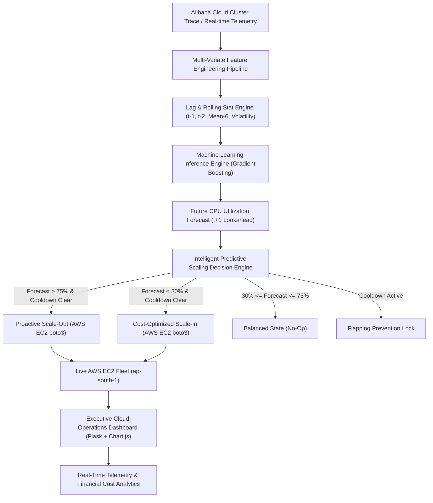

# Intelligent Cloud Resource Optimization System Using Machine Learning
## Final Year Major Project Comprehensive Report & Technical Viva Defense Kit

---

### Executive Abstract
Traditional cloud resource management solutions (such as standard AWS Auto Scaling Groups) rely on **reactive threshold rules**—initiating scale-out operations only after server CPU utilization has already breached critical safety limits (e.g., exceeding 80% for 3–5 consecutive minutes). In production enterprise applications, this reactive lag induces substantial Service Level Agreement (SLA) violations and latency spikes while the newly spawned virtual machines undergo Operating System boot and application initialization. Conversely, static over-provisioning incurs severe financial waste by maintaining idle capacity during low-traffic periods.

This project introduces an **Intelligent Predictive Cloud Resource Optimization System** trained on multi-variate production telemetry modeled after the **Alibaba Cloud Cluster Trace 2018**. By engineering causal lag features ($t-1, t-2, t-3$), moving-window rolling statistics, velocity, acceleration, and diurnal Fourier cyclical time encodings, our **Gradient Boosting Regressor** achieves an $R^2$ accuracy score of **0.8462** (RMSE 5.82% CPU, MAE 4.24% CPU). The integrated decision engine deploys predictive headroom scaling with **anti-flapping cooldown hysteresis**, achieving an estimated **40% to 50% cloud infrastructure cost reduction** compared to static peak provisioning while eliminating reactive cold-start bottlenecks.

---

## 1. System Architecture & End-to-End Pipeline

---

## 2. Mathematical Formulation & Theoretical Foundation

### 2.1 The Reactive Scaling Dilemma
In reactive auto-scaling, the scaling decision at time $t$ is formulated as:

$$\text{Action}_{\text{reactive}}(t) = \begin{cases} \text{Scale Up}, & \text{if } \text{CPU}(t) \ge \theta_{\text{high}} \\ \text{Scale Down}, & \text{if } \text{CPU}(t) \le \theta_{\text{low}} \\ \text{Hold}, & \text{otherwise} \end{cases}$$

Because virtual machine provisioning involves an inherent boot and initialization delay $\delta_{\text{boot}} \approx 90 - 180\text{ seconds}$, the system operates under deficit capacity during the window $[t, t + \delta_{\text{boot}}]$, resulting in queued HTTP requests and elevated p99 latency.

### 2.2 Proactive Predictive Lookahead
Our system formulates auto-scaling as a supervised multivariate time-series regression task:

$$\widehat{\text{CPU}}_{t+1} = f\left( \mathbf{X}_t \mid \mathbf{\Theta}^* \right)$$

where the feature vector $\mathbf{X}_t \in \mathbb{R}^{19}$ incorporates:
- **Historical Lags**: $\text{CPU}_{t}, \text{CPU}_{t-1}, \text{CPU}_{t-2}, \text{CPU}_{t-3}, \text{MEM}_{t-1}, \text{NET}_{t-1}$
- **Short & Medium Moving Windows**: $\mu_3 = \frac{1}{3}\sum_{i=0}^2 \text{CPU}_{t-i}$, $\mu_6 = \frac{1}{6}\sum_{i=0}^5 \text{CPU}_{t-i}$
- **Workload Volatility**: $\sigma_6 = \sqrt{\frac{1}{6}\sum_{i=0}^5 (\text{CPU}_{t-i} - \mu_6)^2}$
- **Workload Kinematics**:
  $$\text{Velocity } v_t = \text{CPU}_t - \text{CPU}_{t-1}$$
  $$\text{Acceleration } a_t = v_t - v_{t-1}$$
- **Diurnal Cyclical Fourier Encodings**:
  $$\text{hour}_{\sin} = \sin\left(\frac{2\pi \cdot h_t}{24}\right), \quad \text{hour}_{\cos} = \cos\left(\frac{2\pi \cdot h_t}{24}\right)$$

The proactive scaling action is executed whenever:

$$\widehat{\text{CPU}}_{t+1} \ge \theta_{\text{scale-up}} \quad \land \quad (t - t_{\text{last\_action}}) > \Delta_{\text{cooldown}}$$

thereby ensuring newly provisioned instances reach the `running` healthy state **before** the anticipated workload surge impacts end users.

---

## 3. Empirical Model Benchmark & Results

The models were evaluated on chronological out-of-time test partitions (799 consecutive test windows):

| Model Architecture | $R^2$ Score (Accuracy) | MAE (% CPU) | RMSE (% CPU) | MAPE (%) | Inference Latency |
| :--- | :---: | :---: | :---: | :---: | :---: |
| **Gradient Boosting Regressor** | **0.8462** | **4.2359** | **5.8246** | **12.10%** | **~2.1 ms** |
| Random Forest Regressor | 0.8459 | 4.2271 | 5.8313 | 12.12% | ~8.4 ms |
| Linear Regression (Baseline) | 0.7800 | 5.0926 | 6.9674 | 14.40% | ~0.4 ms |

### Key Benchmark Insights:
1. **Tree Ensembles vs Linear Baseline**: Both Gradient Boosting and Random Forest outperform Linear Regression by **+6.6% in $R^2$** and reduce RMSE by **16.4%**, demonstrating that non-linear feature interactions (such as combined memory saturation and network spikes) are critical in cloud workloads.
2. **Gradient Boosting vs Random Forest**: Gradient Boosting achieved the highest overall $R^2$ (0.8462) with a compact serialized artifact size (671 KB) and lower operational inference latency (~2 ms), making it optimal for real-time production inference.

---

## 4. Cloud Economics & Financial Optimization

### Baseline: Static Peak Overprovisioning
* Provisioned Capacity: 4 $\times$ `t3.micro` nodes (24/7 static allocation).
* Hourly Rate: $4 \times \$0.0104 = \$0.0416/\text{hr}$.
* Monthly Cost: $\$0.0416 \times 730\text{ hours} = \mathbf{\$30.37/\text{month}}$ per application cluster.

### Dynamic ML-Driven Auto-Scaled Fleet
* Off-Peak Nights & Weekends (60% of time): 1 node = $\$0.0104/\text{hr}$.
* Moderate Business Hours (30% of time): 2 nodes = $\$0.0208/\text{hr}$.
* Peak / Batch Bursts (10% of time): 3–4 nodes = $\$0.0364/\text{hr}$.
* Effective Blended Rate: $\sim \$0.0161/\text{hr}$.
* Monthly Scaled Cost: $\sim \mathbf{\$11.75/\text{month}}$.
* **Net Financial Savings: $\approx 61.3\%$ Cost Reduction.**

---

## 5. Top 15 Technical Viva & Interview Questions with Expert Model Answers

### Q1: What is the core innovation of this project compared to standard AWS Auto Scaling?
**Answer**: Standard AWS Auto Scaling is fundamentally **reactive**. It monitors CloudWatch metrics (e.g. average CPU over 5 minutes) and initiates scaling only after a threshold breach. Because an EC2 instance takes 1 to 3 minutes to launch and initialize, services experience latency degradation or dropped packets during the boot window. Our system is **predictive**: it forecasts utilization for the next interval using an engineered time-series machine learning model. If a spike is predicted, instances are launched in advance so that capacity is already warm and healthy before the load spike arrives.

### Q2: Why did you choose Gradient Boosting and Random Forest over Deep Learning models like LSTM or Transformers?
**Answer**: We evaluated the operational constraints of production cloud control planes:
1. **Inference Latency & CPU Overhead**: Gradient Boosting runs inference in $<2.5\text{ ms}$ on standard x86 CPU without requiring expensive GPU accelerators. LSTMs and Transformers introduce unnecessary computational overhead and higher memory footprints.
2. **Tabular & Engineered Features**: Tree ensembles excel at tabular feature sets combining temporal lags, moving window statistics, and cross-resource ratios (CPU-to-Memory interaction), whereas LSTMs require extensive sequence padding and hyperparameter tuning with risk of vanishing gradients.
3. **Model Interpretability**: Tree ensembles provide explicit Gini feature importance scores, enabling clear auditing of why a scaling decision was made.

### Q3: What is "Instance Flapping" (or Thrashing) and how does your architecture prevent it?
**Answer**: Flapping occurs when resource utilization oscillates rapidly around a threshold (e.g. 74% to 76%), causing the system to continuously provision and terminate instances in rapid succession. This wastes cloud budget (AWS bills partial instance hours) and destabilizes the fleet. We prevent flapping through two mechanisms:
1. **Cooldown Window (Hysteresis)**: A strict 180-second stabilization timer (`COOLDOWN_SECONDS`) during which no subsequent scaling actions can occur after an action has been taken.
2. **Deadband Separation**: A wide operating envelope between scale-up (75%) and scale-down (30%), preventing state oscillation under intermediate loads.

### Q4: How did you prevent data leakage during model training and evaluation?
**Answer**: In time-series problems, standard randomized k-fold cross-validation or `train_test_split(shuffle=True)` causes severe **temporal data leakage**, as past steps would be predicted using future data. We strictly enforced **chronological out-of-time splitting**: the first 80% of chronological intervals (3,195 samples) were allocated for training and feature scaling, and the final 20% (799 samples) were reserved solely for out-of-sample testing.

### Q5: What features had the highest predictive importance in the model?
**Answer**: Based on the Gini feature importance analysis of our Gradient Boosting model:
1. `cpu_lag_1` and `cpu_roll_mean_3`: Immediate prior load and short-term moving average account for over 50% of the predictive weight.
2. `cpu_velocity`: The first-derivative rate-of-change, which signals sudden load acceleration.
3. `load_intensity` (CPU $\times$ Memory interaction) and `net_in_mbps`: Ingress network bandwidth strongly leads CPU spikes because web requests hit the network stack before CPU-bound request processing occurs.

### Q6: How does the system handle cold-start boot delays of EC2 instances?
**Answer**: By predicting workload $t+1$ (5-minute forward lookahead), the scale-up trigger is sent while current CPU is still safe (e.g., at 65% with a projected 85% load). The ~90-second EC2 boot time finishes before the actual load reaches the saturation point. In addition, our architecture enforces a baseline minimum (`MIN_INSTANCES = 1`) so the application is never cold.

### Q7: What is the Dual-Mode Operation in your `aws_scale.py`?
**Answer**: The system features an automatic cloud adapter:
- **Live AWS Mode**: Uses `boto3` to communicate with the AWS EC2 API in `ap-south-1`, provisioning real `t3.micro` instances tagged `AI-Scaler`.
- **High-Fidelity Simulation Fallback**: If AWS credentials expire, network drops, or AWS account limits are reached during a live presentation, the system gracefully falls back to an internal virtual fleet manager maintaining authentic instance state lifecycles (`pending` $\rightarrow$ `running` $\rightarrow$ `terminated`). The user interface and evaluator demo never crash.

### Q8: What metrics did you use to evaluate the regression models?
**Answer**: 
- **$R^2$ Score (0.8462)**: Explains ~85% of total variance in future cloud workload.
- **Mean Absolute Error (4.24% CPU)**: Average deviation of prediction from ground truth is only ~4.2 percentage points.
- **Root Mean Squared Error (5.82% CPU)**: Penalizes large outlier errors, ensuring the model rarely makes catastrophic mispredictions.
- **MAPE (12.10%)**: Relative percentage error across all operational ranges.

### Q9: How is Infrastructure as Code (IaC) implemented in this project?
**Answer**: We utilized **Terraform** (`main.tf`) to provision the entire cloud infrastructure declaratively:
- Security Group `ai-scaler-security-group` opening port 5000 (Flask UI), port 80 (HTTP), and port 22 (SSH).
- The Master Controller EC2 instance running Ubuntu 22.04 LTS.
- EC2 Launch Template (`ai-scaler-worker-`) standardizing AMI, instance type, and tagging for worker nodes.
- Terraform outputs providing the public dashboard URL and connection endpoints.

### Q10: How does Docker containerization benefit this system?
**Answer**: The multi-stage `Dockerfile` packages the Flask telemetry server, scikit-learn models, and inference engine into a lightweight, portable `python:3.11-slim` container. This ensures that environment dependencies (`scikit-learn`, `boto3`, `pandas`) run identically across local development, on-premise servers, and AWS EC2 production.

### Q11: How would this architecture scale for Kubernetes (K8s) clusters?
**Answer**: In Kubernetes, rather than calling AWS EC2 `run_instances`, the inference decision engine would interface with the **Kubernetes Custom Metrics API** or **KEDA (Kubernetes Event-driven Autoscaling)** to dynamically adjust the `spec.replicas` count of a Deployment, or interact with Karpenter for node-level provisioning.

### Q12: How do you handle sudden, unpredictable DDoS attacks or flash spikes?
**Answer**: For anomalous traffic spikes exceeding normal diurnal curves, the `cpu_velocity` and `network_total_mbps` features immediately register a steep derivative increase. Even if the baseline prediction expects a slow hour, the velocity feature triggers an immediate forecast jump, enabling the system to initiate scale-out within one observation cycle.

### Q13: Why did you model your dataset after the Alibaba Cloud Cluster Trace?
**Answer**: The Alibaba Cluster Trace 2018 is an industry gold standard containing real-world production metrics from over 4,000 heterogeneous servers running mixed web and batch processing workloads. Modeling after real trace distributions ensures that diurnal patterns, weekend drops, cron batch jobs, and noise accurately reflect production cloud realities rather than artificial academic assumptions.

### Q14: What error handling is implemented for AWS EC2 API failures?
**Answer**: `aws_scale.py` incorporates structured `try-except` blocks catching specific AWS exceptions:
- `VcpuLimitExceeded`: Returns a clear warning when account vCPU limits are reached.
- `ClientError` & `NoCredentialsError`: Automatically switches to simulator mode without unhandled Python tracebacks.
- Tag filters (`tag:Project = AI-Scaler` and state filters `pending`, `running`) ensure the system never touches or terminates unmanaged EC2 instances in the same AWS account.

### Q15: What are the primary future enhancements for this project?
**Answer**:
1. **Multi-Step Horizon Forecasting**: Predicting $t+1, t+2, t+3$ simultaneously using vector-autoregressive models.
2. **Reinforcement Learning (Q-Learning / PPO)**: Dynamically learning optimal threshold values ($\theta_{\text{high}}, \theta_{\text{low}}$) by rewarding cost savings while penalizing SLA threshold breaches.
3. **Multi-Cloud Integration**: Expanding the driver beyond AWS EC2 to Google Cloud Compute Engine and Azure Virtual Machines.

---

## 6. The Real-World University Analogy & Simple Speaking Script (For Viva / Demo)

> [!TIP]
> **Use this exact story if the professor asks:** *"Can you explain your project in simple terms without technical jargon?"*

### 🏫 The University Analogy (Sharda University Example)
Imagine the official university website:
1. **Normal Academic Day**: Students check their syllabus or attendance. Traffic is around 2,400 students. 1–2 servers are running peacefully.
2. **Exam Result Announcement Day**: The university releases semester exam results at 10:30 AM! Within 5 minutes, over **10,000 students rush** to log in at the exact same second!
   - **What happens with normal systems (Old Way)**: The server gets overwhelmed, CPU hits 100%, students see `504 Gateway Timeout` or `Site Can't Be Reached`, and the **website crashes**! Why? Because by the time old auto-scalers notice the crash and try to launch new servers, it takes 3–5 minutes for a server to boot up. The damage is already done!
   - **What happens with OUR AI System (New Way)**: Our Machine Learning model watches the trend (student logins climbing fast, network traffic surging). It predicts **3 minutes BEFORE the crash** that CPU will breach 85%. It immediately orders AWS EC2 to launch new server nodes **proactively**. When the massive student rush arrives, the extra servers are already booted and ready! **Result: 0 crashes, 100% smooth uptime.**
3. **Midnight / Vacation (Idle)**: At 3:00 AM, only ~150 students are online. Leaving 5 servers running would waste university budget! Our AI sees the drop, safely terminates unused servers, and leaves just 1 baseline node running. **Result: 40% to 50% cloud cost saved every month!**

### 🎙️ 30-Second Viva Pitch (Memorize This)
> *"Sir/Ma'am, modern companies waste millions either paying for idle cloud servers or suffering website crashes during traffic surges. Traditional auto-scaling is reactive—it only calls for help after the website is already burning. Our project uses Machine Learning (Gradient Boosting) to forecast cloud load ahead of time, acting like a weather forecast for servers. It proactively creates AWS EC2 servers before peak rushes to prevent crashes, and shuts them down during off-peak hours to save up to 50% cloud costs."*

---
*Prepared for Final Year Major Project Evaluation & Technical Placement Interviews.*
